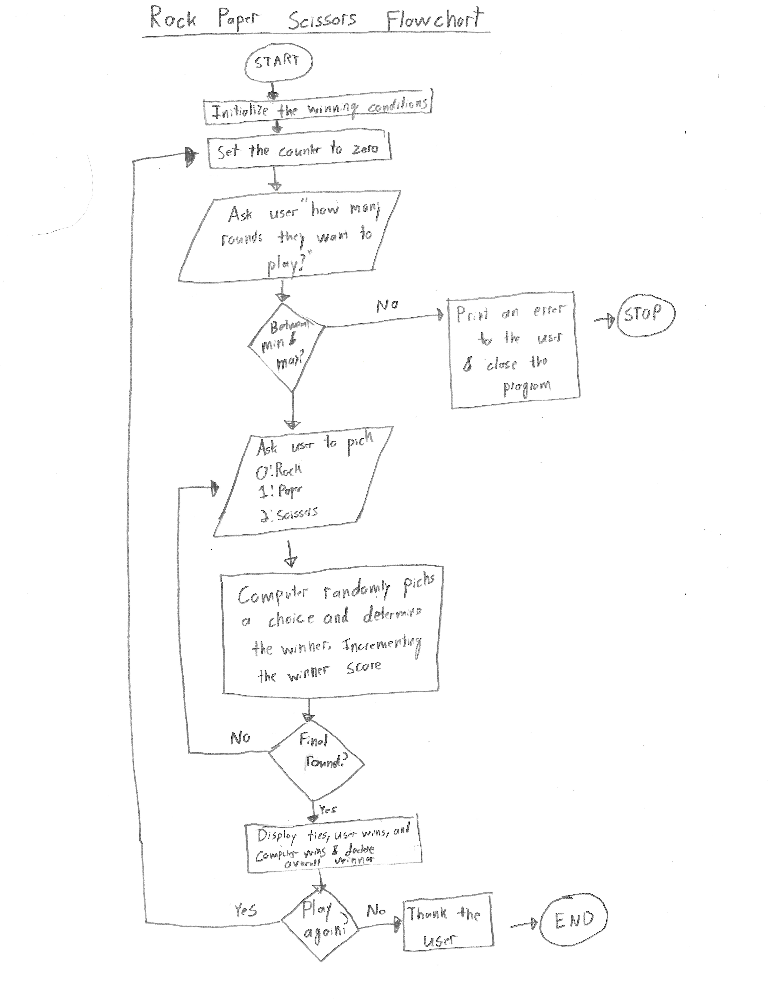

# RockPaperScissors
 
 ## Flowchart

## Overview

This purpose of this activity is to demonstrate your proficiency in basic Java syntax involving console input and output, variables, flow of control statements, and expressions. These core concepts are the building blocks for more complicated code that is to come.

In this activity, you will write a program that plays the game Rock, Paper, Scissors.
## Task List
- Create a flowchart that describes what the program will do.
- Show your flowchart to your instructor.
- After receiving approval for your flowchart, begin writing code.
- Write the code in stages, checking that each stage works before continuing to the next stage.
- Once all parts of the code work as expected and the program meets all requirements listed below, submit the code using instructions provided by your instructor.

## Rules

The rules of the game are as follows:

- Each player chooses Rock, Paper, or Scissors.
- If both players choose the same thing, the round is a tie.
- Otherwise:
-- Paper wraps Rock to win
-- Scissors cut Paper to win
-- Rock breaks Scissors to win

## Requirements

This program will be a Java console application named RockPaperScissors.

- The program first asks the user how many rounds he/she wants to play.
-- Maximum number of rounds = 10, minimum number of rounds = 1.
-- If the user asks for something outside this range, the program prints an error message and quits.
-- If the number of rounds is in range, the program plays that number of rounds.
-- Each round is played according to the requirements below.
- For each round of Rock, Paper, Scissors, the program does the following:
-- The computer asks the user for his/her choice (Rock, Paper, or Scissors). Hint: 1 = Rock, 2 = Paper, 3 = Scissors

- After the computer asks for the user’s input, the computer randomly chooses Rock, Paper, or Scissors and displays the result of the round (tie, user win, or computer win).
-- Hint: Use the Random class.
- The program must keep track of how many rounds are ties, user wins, or computer wins.
-- Hint: Create three variables to keep track of these items and update them correctly after each round.
- At the end of the last round, the program must print out the number of ties, user wins, and computer wins and declare the overall winner based on who won more rounds.
- After all rounds have been played and the winner declared, the program must ask the user if he/she wants to play again.
-- If the user says No, the program prints out a message like, “Thanks for playing!” and then exits.
-- If the user says Yes, the program starts over, asking the user how many rounds he/she would like to play.

